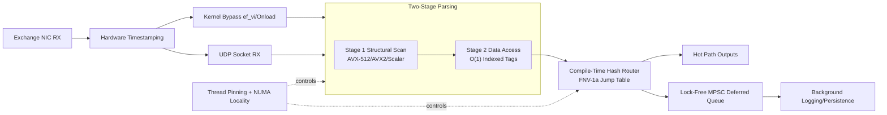

# Ultra-Low Latency Market Data Gateway

A deterministic, low-jitter, C++20 market data ingress engine built for high-frequency environments where microbursts, cache misses, and scheduling noise are first-class risks.

## Visual Sell

### What this gateway is optimized for

- Deterministic critical path: network -> parse -> route
- Flat latency curve under sustained throughput
- Minimal allocator pressure on hot loops
- Isolated non-critical work (logging/persistence) off the fast path

### Architecture at a glance



### Performance waterfall (target shape)

```mermaid
gantt
    title Latency Waterfall (ns) - Per Message Budget
    dateFormat  X
    axisFormat %L
    section Critical Path
    NIC ingress + timestamp          :a1, 0, 80
    Kernel bypass / socket receive   :a2, after a1, 100
    Structural scan (SIMD)           :a3, after a2, 150
    Data access + tag lookup         :a4, after a3, 70
    Message routing                  :a5, after a4, 40
    section Deferred Path
    MPSC enqueue deferred task       :b1, 0, 20
    Background persistence/logging   :b2, after b1, 400
```



## Key Capabilities

- Hierarchical CMake project with modular runtime layers
- Two-stage parsing pipeline with SIMD structural scanning
- O(1) field access using structural index and consteval tag tables
- PMR monotonic arena usage in parsing hot path
- SBE flyweight overlays for direct binary buffer access
- Compile-time FNV-1a routing hashes for switch-based dispatch
- Slowpath isolation and branch hints for instruction cache protection
- Linux hardware timestamping and optional Solarflare ef_vi/Onload hooks
- Thread affinity and NUMA-aware memory placement
- Lock-free MPSC deferred queue for non-critical work
- Google Benchmark suite reporting p50/p99 and flatness ratio

## Build

```powershell
cmake -S . -B build -DCMAKE_BUILD_TYPE=Release
cmake --build build --config Release
ctest --test-dir build --output-on-failure
```

Optional kernel bypass build flag:

```powershell
cmake -S . -B build -DULL_ENABLE_EFVI=ON
```

Benchmark build and run:

```powershell
cmake -S . -B build -DULL_BUILD_BENCHMARKS=ON
cmake --build build --config Release --target ull_benchmarks
./build/benchmarks/Release/ull_benchmarks.exe --benchmark_format=console --benchmark_min_time=0.01s
```

## Benchmark Readout

The benchmark suite exports these counters:

- p50_ns: median single-message latency
- p99_ns: high-percentile tail latency
- flat_ratio: p99_ns / p50_ns
- flat_ok: 1 when flat_ratio is within threshold

## Repository Layout

- apps/gateway: executable entrypoint
- src/common: topology and queue primitives
- src/network: transport, timestamping, kernel-bypass hooks
- src/feeds: SIMD scan, indexed access, tag dispatch
- src/sbe: flyweight binary overlays
- src/gateway: routing, execution controls, deferred offload
- tests: functional and concurrency tests
- benchmarks: latency-distribution benchmark suite

## Technical Manual

See docs/TECHNICAL_MANUAL.md for deep implementation details, operational notes, and additional diagrams.
