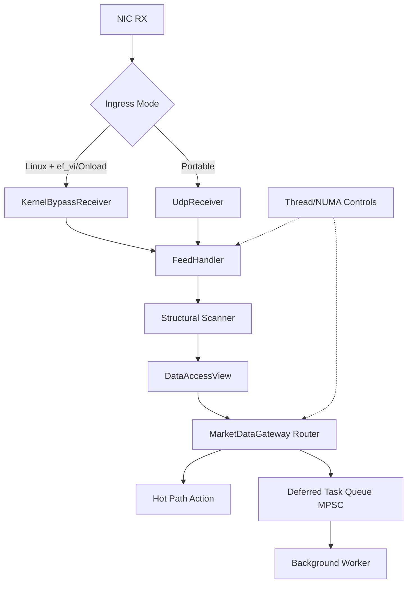
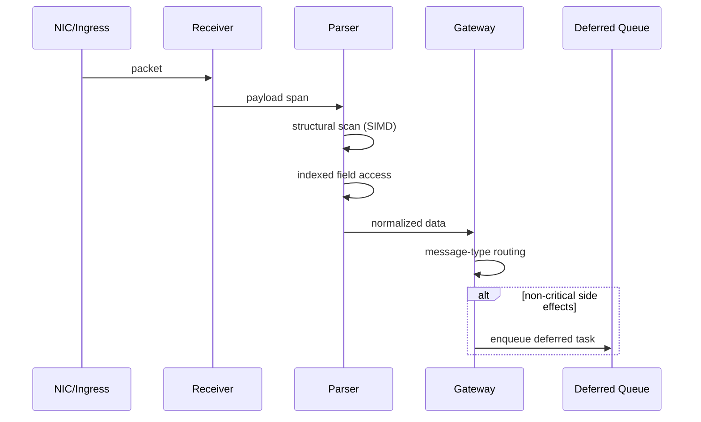

# Technical Manual: Ultra-Low Latency Market Data Gateway

## 1. Scope

This manual defines architecture, module contracts, runtime controls, and performance methodology for the Ultra-Low Latency Market Data Gateway.

Primary engineering goals:

- Deterministic end-to-end processing latency
- Bounded jitter under burst traffic
- Predictable CPU and memory behavior
- Strict separation between critical and non-critical workloads

## 2. System Architecture



## 3. Module Reference

### 3.1 Common

Major components:

- fnv1a.hpp: compile-time and runtime FNV-1a hashing
- mpsc_queue.hpp: lock-free bounded MPSC queue
- spsc_ring_buffer.hpp: SPSC ring primitive
- thread_topology.hpp + thread_topology.cpp: thread affinity and NUMA-aware allocation

### 3.2 Network

Major components:

- udp_receiver: socket ingress and timestamping configuration
- kernel_bypass: optional Solarflare ef_vi/Onload integration layer

Timestamping modes:

- disabled
- software
- hardware

### 3.3 Feeds

Two-stage parser:

- Stage 1: structural scan using AVX-512, AVX2, or scalar fallback
- Stage 2: indexed data access with known-tag direct slots and hashed fallback

Optimization techniques:

- assume_aligned fast paths for aligned SIMD loads
- branch-hinting with likely/unlikely on hot loops
- PMR monotonic parse context for allocation-free marker buffering

### 3.4 Gateway

Major capabilities:

- Compile-time FNV-1a hash constants for message type dispatch
- O(1) switch-based routing path with collision verification
- Deferred non-critical task offload via lock-free MPSC
- Thread pinning and NUMA working-set hooks

### 3.5 SBE

- Packed wire structs and flyweight wrappers
- Zero-copy direct overlay on network buffers
- Buffer-size guards for safe wrapping

## 4. Critical Path Sequence



## 5. Deferred Processing Model

Purpose:

- Keep logging, persistence, telemetry, and audit side effects off hot route path

Mechanics:

- Producers: one or many hot-path contexts
- Consumer: single background worker
- Queue type: bounded lock-free MPSC

Operational note:

- Queue saturation should trigger explicit drop/backpressure policy in production deployment.

## 6. Determinism Controls

### 6.1 Thread Affinity

- Pin critical threads to stable CPU cores
- Avoid scheduler migration and cache warmup loss

### 6.2 NUMA Locality

- Allocate working sets on intended NUMA node
- Co-locate compute threads and memory to reduce remote access latency

## 7. Performance Methodology

Benchmark suite:

- Target: ull_benchmarks
- Framework: Google Benchmark
- Sampling: manual-time with batched operations

Metrics:

- p50_ns
- p99_ns
- flat_ratio = p99_ns / p50_ns
- flat_ok (binary threshold pass/fail)

Interpretation:

- A flat line profile means low divergence between p50 and p99
- Sustained flat_ok=1 under load is a quality target

### 7.1 Performance Waterfall Template

```mermaid
gantt
    title Processing Waterfall Template (ns)
    dateFormat X
    axisFormat %L
    section Hot Path
    Receive          :a1, 0, 100
    Parse            :a2, after a1, 180
    Route            :a3, after a2, 40
    section Deferred
    Enqueue Deferred :b1, 0, 20
    Background Work  :b2, after b1, 400
```



## 8. Build and Execution

Core build:

```powershell
cmake -S . -B build -DCMAKE_BUILD_TYPE=Release
cmake --build build --config Release
ctest --test-dir build --output-on-failure
```

Enable benchmark suite:

```powershell
cmake -S . -B build -DULL_BUILD_BENCHMARKS=ON
cmake --build build --config Release --target ull_benchmarks
```

Enable ef_vi integration hooks:

```powershell
cmake -S . -B build -DULL_ENABLE_EFVI=ON
```

## 9. Platform Notes

- Windows builds and tests all modules with portable fallbacks.
- Linux enables timestamping and kernel-bypass integration paths when dependencies exist.
- ef_vi runtime support depends on platform, driver stack, and header availability.

## 10. Validation Matrix

Recommended validation gates:

- Functional tests: all Catch2 tests pass
- Concurrency tests: MPSC/SPSC tests pass with repeatability
- Microbenchmarks: p50/p99 stable and flat_ok maintained
- Integration checks: receiver mode and timestamping mode configured as expected
